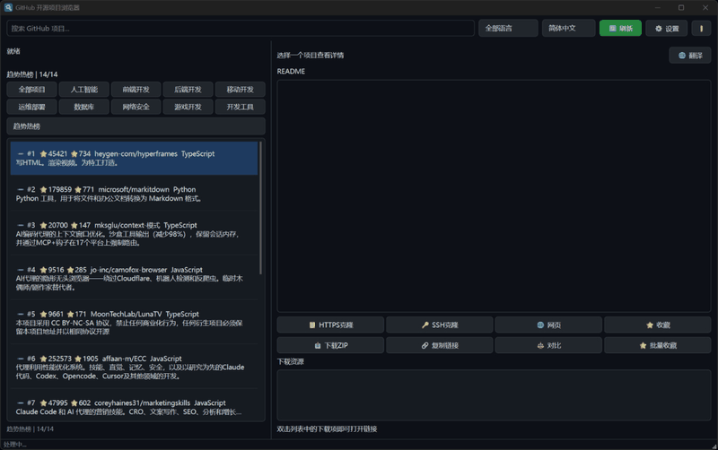
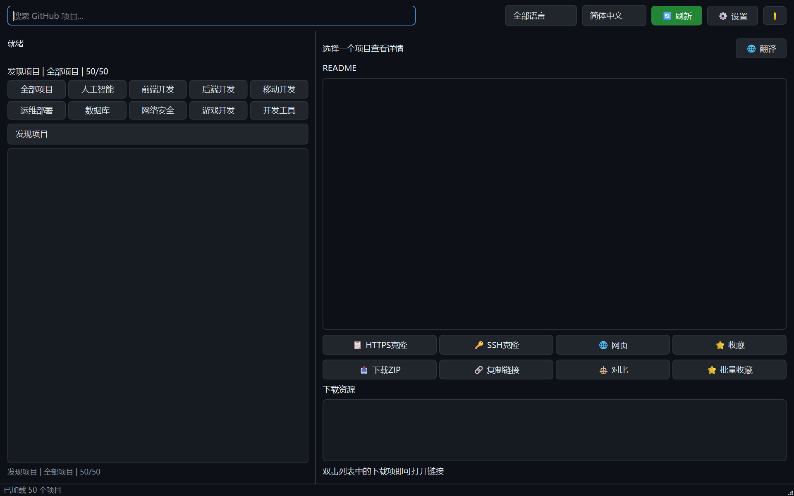
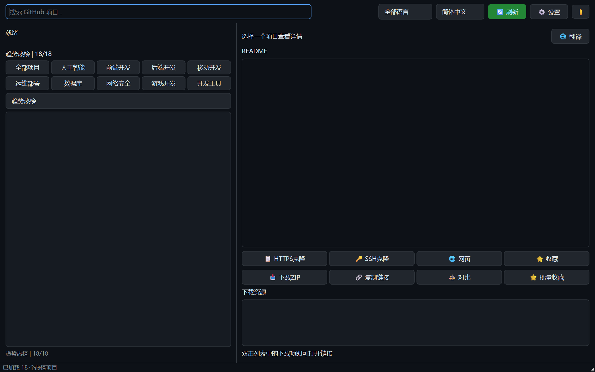
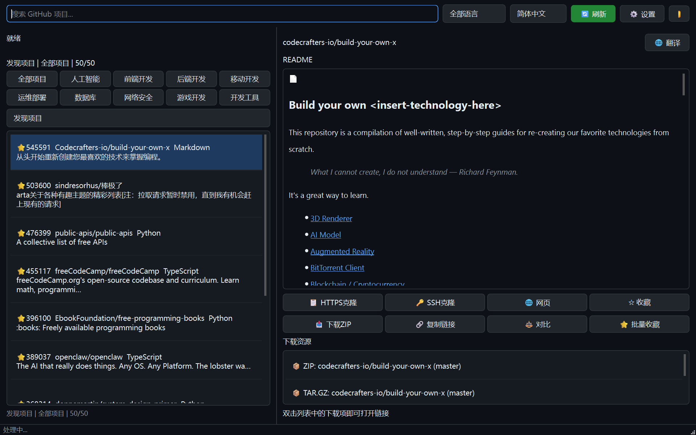
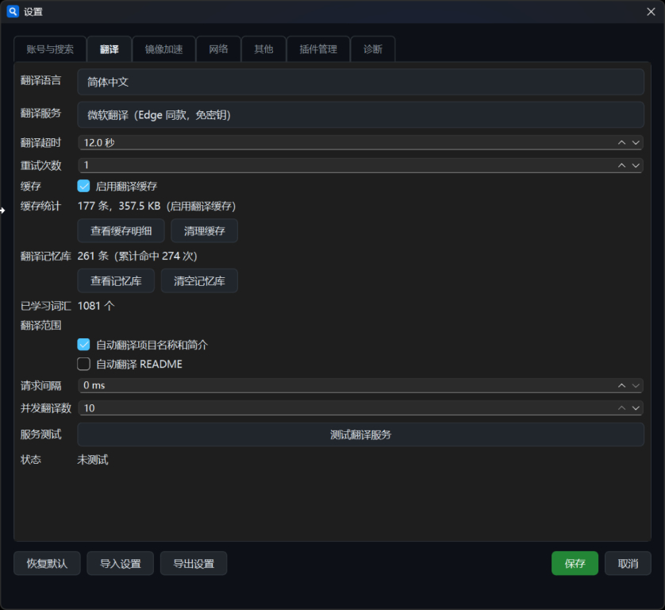

<h1 align="center">
    
</h1>

<p align="center">
    <strong>GitHub 开源项目浏览器</strong>
    <br>
    <em>发现、浏览、翻译 GitHub 优质开源项目</em>
</p>

<p align="center">
    <a href="https://www.python.org/downloads/"></a>
    <a href="https://pypi.org/project/PyQt6/"></a>
    <a href="LICENSE"></a>
    <a href="https://github.com/chenyang3333333/github-open-source-browser/stargazers"></a>
    <a href="https://github.com/chenyang3333333/github-open-source-browser/network/members"></a>
</p>

<p align="center">
    <a href="https://github.com/chenyang3333333/github-open-source-browser/releases/latest"></a>
</p>

<p align="center">
    <a href="#-快速开始"><strong>快速开始</strong></a>
    · <a href="#-界面截图"><strong>界面截图</strong></a>
    · <a href="#-功能特性"><strong>功能特性</strong></a>
    · <a href="#-配置说明"><strong>配置说明</strong></a>
    · <a href="#-项目结构"><strong>项目结构</strong></a>
    · <a href="#-技术栈"><strong>技术栈</strong></a>
</p>

---

一个基于 **Python + PyQt6** 的桌面应用，帮助你快速发现、浏览 GitHub 上的优质开源项目。

**核心能力：** 按星星数量排序的「发现」页 · GitHub 官方「趋势热榜」· 领域分类浏览 · 多引擎智能翻译（项目名/简介/README）· 离线缓存与收藏管理

> **v2.7.0** | 极速加载，实时翻译，本地缓存。由开源爱好者为开源爱好者构建。

---

## 🚀 快速开始

**下载即用，无需安装 Python：**

👉 [下载最新版 GitHub.exe](https://github.com/chenyang3333333/github-open-source-browser/releases/latest)

<details>
<summary><strong>源码运行</strong></summary>

```bash
git clone https://github.com/chenyang3333333/github-open-source-browser.git
cd github-open-source-browser
pip install -r requirements.txt
python run_app.py --run
```

</details>

<details>
<summary><strong>打包 exe</strong></summary>

```bash
python run_app.py --buildexe
```

</details>

---

## 🖥️ 界面截图

<table>
  <tr>
    <td width="50%">
      <h3 align="center">🔍 发现页</h3>
      <p align="center">按星星排序 + 滚动加载更多 + 多引擎智能翻译</p>
      
    </td>
    <td width="50%">
      <h3 align="center">🔥 趋势热榜</h3>
      <p align="center">GitHub 官方排名 + 涨跌标记 + 中文翻译</p>
      
    </td>
  </tr>
  <tr>
    <td width="50%">
      <h3 align="center">📖 项目详情</h3>
      <p align="center">README 中文翻译 + 克隆/下载/收藏</p>
      
    </td>
    <td width="50%">
      <h3 align="center">⚙️ 设置</h3>
      <p align="center">翻译引擎 / 主题 / 语言 / 镜像加速</p>
      
    </td>
  </tr>
</table>

---

## ✨ 功能特性

### 🔍 发现开源项目

- 🚀 启动自动从 GitHub Search API 拉取高星项目，**统一按星星数量降序**展示
- 📜 **滚动到底自动加载更多**：每页 50 条、无数量上限，追加数据与已有列表排序完美衔接
- 🏷️ **领域分类浏览**：内置 AI、前端、后端、移动端、DevOps、安全等分类

### 🔥 趋势热榜

- 📊 抓取 `github.com/trending` 官方榜单，展示当日/本周/本月新增星星、排名涨跌（🔺/🔻/🆕）
- 🔄 翻译完成后**保留官方排名与涨跌前缀**，不会被翻译结果覆盖
- 🗂️ 按分类语言重新抓取 Trending 页面并合并去重

### 🌐 多引擎智能翻译

项目名称、简介、README 一键翻译成中文，回退链自动切换：

| 引擎 | 特点 | 需要 |
|------|------|------|
| **LLM 大模型** | 翻译质量最高 | OpenAI 兼容接口 |
| **腾讯云 TMT** | 国内直连、免费额度 | API Key |
| **Edge 微软翻译** | 免 Key、国内直连 | 无 |
| **Google / DeepL** | 免费 | 可访问外网 |
| **本地术语词典** | 1900+ 条，永不失败 | 无 |

- 💾 翻译结果走 **SQLite 缓存**（30 天 TTL），二次打开秒开
- ⚡ 切换视图自动取消在途翻译，线程池不拥堵

### ⚙️ 其他能力

| 功能 | 说明 |
|------|------|
| 📖 项目详情页 | README 中文翻译、语言/Stars/Forks/更新日期、下载镜像加速 |
| ⭐ 收藏夹 / 历史 | 数据保存在本地 SQLite，可离线回顾 |
| 🎨 主题 / 国际化 | 深色浅色主题、中英文界面、窗口缩放自适应 |
| 🔒 安全加密 | GitHub Token、翻译 Key 使用 Windows DPAPI 加密落盘 |
| 🪞 镜像加速 | 内置多个 GitHub 镜像源，解决国内访问慢的问题 |
| 🔌 插件系统 | 支持自定义插件扩展功能 |

---

## ⚙️ 配置说明

首次运行后，配置文件与数据库保存在：

```
%APPDATA%\GitHubOpenSourceBrowser\
├── config.json            # 用户配置（Token/密钥经 DPAPI 加密）
├── app.db                 # 收藏/历史/翻译缓存等
└── translation_cache.json # 翻译缓存副本
```

可在设置界面配置：翻译引擎与回退链、翻译目标语言、GitHub Token、每页加载数量、主题与界面语言等。

---

## 📁 项目结构

```
github_open_source_browser/
├── app.py                 # 应用入口
├── config.py              # 配置读写与 DPAPI 加密
├── database.py            # SQLite 数据库操作
├── translator.py          # 翻译管理器
├── plugins.py             # 插件系统
├── ui/
│   ├── main_window.py     # 主界面与全部交互逻辑
│   ├── settings_dialog.py # 设置对话框
│   ├── theme.py           # 主题管理
│   ├── loading.py         # 加载动画
│   └── enhancements.py    # UI 增强组件
├── services/
│   ├── github_service.py  # GitHub API / Trending 抓取
│   ├── translation_service.py # 多引擎翻译 + 回退链
│   └── http_client.py     # HTTP 客户端封装
└── i18n/                  # 中英文界面文案
    ├── zh_CN.json
    └── en_US.json
```

---

## 🛠️ 技术栈

| 组件 | 技术 |
|------|------|
| **界面** | Python 3.11 + PyQt6 |
| **网络** | Requests + 自定义 HTTP 客户端 |
| **存储** | SQLite（收藏/历史/翻译缓存） |
| **打包** | PyInstaller |
| **翻译** | OpenAI / 腾讯云 TMT / Edge / Google / DeepL / 本地词典 |
| **数据源** | GitHub REST API / Search API / Trending 页面解析 |
| **加密** | Windows DPAPI |

---

## 🤝 贡献

欢迎提交 Issue 和 Pull Request！

1. Fork 本仓库
2. 创建特性分支 (`git checkout -b feature/AmazingFeature`)
3. 提交改动 (`git commit -m 'Add some AmazingFeature'`)
4. 推送分支 (`git push origin feature/AmazingFeature`)
5. 打开 Pull Request

---

## 📄 许可

[MIT License](LICENSE) · 仅供学习交流使用 · 项目数据来源于 GitHub 官方公开接口

---

<p align="center">
    <b>如果觉得有用，请给个 ⭐ Star 支持一下！</b>
</p>
